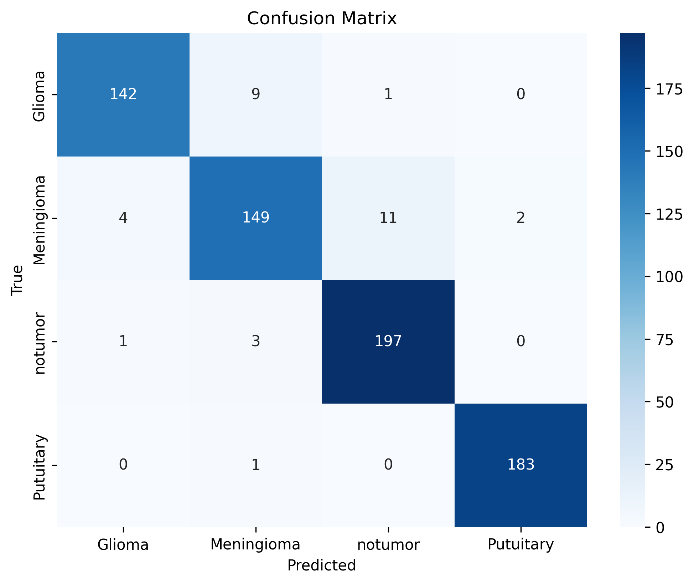

# Brain Tumor Classification with CNN (Optimized Model)

This repository contains an optimized implementation of a convolutional neural network for brain tumor classification, building on our [original replication study](article_model). The enhanced model achieves **96.32% F1-score** through improved regularization and training strategies.

## Dataset Overview

**Source:** Brain Tumor MRI Dataset (Kaggle)  
**Original Size:** 7,023 images (512×512×3)  
**Classes:** 
- Pituitary (1,757 total)
- Meningioma (1,645 total)
- Glioma (1,621 total)
- No Tumor (2,000 total)

**Preprocessing:**
1. Resized to 256×356×3
2. Center-cropped to 200×200×3
3. Training/Validation/Test Split (70/20/10):
   | Class          | Training | Validation | Testing |
   |----------------|----------|------------|---------|
   | Glioma         | 1152     | 327        | 166     |
   | Meningioma     | 1245     | 328        | 184     |
   | No Tumor       | 1391     | 408        | 201     |
   | Pituitary      | 1128     | 341        | 152     |

## Model Architecture

### Convolutional Base (6 Layers)

| Layer | Channels In/Out | Kernel | Padding | Stride | Activation | Pooling | Dropout | Output Shape |
|-------|-----------------|--------|---------|--------|------------|---------|---------|--------------|
| 1     | 3 → 64          | 7×7    | 3       | 1      | ReLU       | 2×2     | 0.45    | 100×100×64   |
| 2     | 64 → 128        | 7×7    | 3       | 1      | ReLU       | 2×2     | 0.45    | 50×50×128    |
| 3     | 128 → 128       | 7×7    | 3       | 1      | ReLU       | 2×2     | 0.45    | 25×25×128    |
| 4     | 128 → 256       | 7×7    | 3       | 1      | ReLU       | 2×2     | 0.45    | 12×12×256    |
| 5     | 256 → 256       | 7×7    | 3       | 1      | ReLU       | 2×2     | 0.4     | 6×6×256      |
| 6     | 256 → 512       | 7×7    | 3       | 1      | ReLU       | 2×2     | 0.4     | 3×3×512      |

### Fully Connected Classifier

| Layer | Units In/Out | Activation | Dropout | Output Shape |
|-------|--------------|------------|---------|--------------|
| 1     | 4608 → 1024  | ReLU       | 0.4     | 1024         |
| 2     | 1024 → 512   | ReLU       | 0.4     | 512          |
| 3     | 512 → 4      | Linear     | -       | 4            |

**Final Layer Note:** Explicit softmax activation is omitted as `nn.CrossEntropyLoss` internally combines log-softmax and negative log-likelihood loss.

## Training Protocol

- **Optimizer:** Stochastic Gradient Descent (SGD)
- **Learning Rate:** 0.001
- **Momentum:** 0.9
- **Loss Function:** Cross Entropy Loss
- **Evaluation metric:** Categorical accuracy
- **Regularization:**
  - Batch Normalization after each conv layer
  - Dropout (p=0.4,0.45) after poolong layers
  - Dropout (p=0.4) in FC layers 
  - Early Stopping
  - Weight decay 0.001
- **Batch Size:** 64
- **Epochs:** 39 (with early stopping)
- **Pacience:** 3

## Results

The trained model achieved on 95.23% Accuracy on validation set and the following performance metrics on the test set:

| Metric     | Value   |
|------------|---------|
| Accuracy   | 96.30%  |
| Precision  | 96.50%  |
| Recall     | 96.30%  |
| F1 Score   | 96.32%  |

Compared to the original model perfomance:

| Metric     | Value   |
|------------|---------|
| Accuracy   | 90.61%  |
| Precision  | 91.11%  |
| Recall     | 98.50%  |
| F1 Score   | 91.36%  |

### Training Dynamics
  
*Figure 1: Training/validation loss and accuracy progression across epochs.*

### Classification Performance
  
*Figure 2: Normalized confusion matrix showing per-class prediction accuracy (4 tumor categories).*

